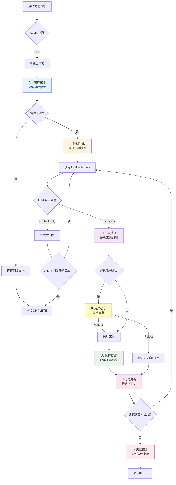
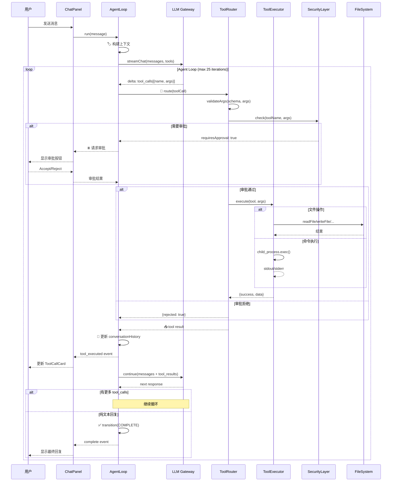
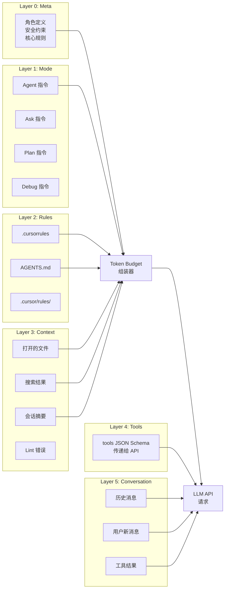
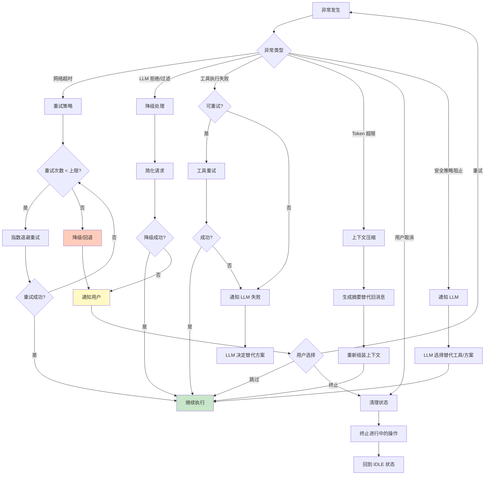

# Cursor Agent 模式 1:1 复刻方案 — 完整设计规格书

> **文档版本**：2.0  
> **日期**：2026-02-18  
> **角色**：Cursor Agent 对齐复刻负责人（Principal Reverse-Design Engineer）  
> **约束**：本文档基于公开信息 + 仓库现状 + 可观测行为实验，禁止臆造私有内部实现

---

## A. Executive Summary（执行摘要）

### 项目现状

cursor-launcher 是一个基于 **Electron 28 + React 18 + Vite 5 + TailwindCSS** 的桌面应用，目标是复刻 Cursor IDE 的 Agent 模式交互体验。

**已完成**（7 项基础功能）：
- 步骤卡片 UI（编辑 diff + 终端执行）
- 内联 diff 展示 / Accept-Reject 按钮
- 命令执行与输出展示 / 思考面板
- 步骤解析（markdown 代码块提取）
- 应用更改确认弹窗（带 diff 预览）

**核心差距**：
- **无原生 Tool Calling 循环** — 当前依赖 markdown 模式匹配，非真正的 `tool_calls` → `tool_result` 闭环
- **无 Agentic 主循环** — 缺少 分析→计划→执行→反思 的自治循环
- **上下文工程薄弱** — 仅有关键词搜索，无 embedding/RAG/记忆摘要
- **提示词体系简陋** — 硬编码在组件中，缺少分层 Prompt 架构
- **无测试基础设施** — 零测试覆盖
- **无 TypeScript** — 无类型安全

**核心策略**：分三阶段 MVP → Beta → Parity，12 周达到行为级对齐。

---

## B. Capability Parity Matrix（能力对齐矩阵）

| # | Cursor 能力 | cursor-launcher 现状 | Gap 等级 | 证据等级 | Action |
|---|------------|---------------------|----------|---------|--------|
| **B1** | Agentic Loop（分析→计划→执行→反思→迭代） | ❌ 无。单轮 LLM 调用 | 🔴 Critical | [Observed] | 实现 AgentLoop 状态机 |
| **B2** | Tool Calling（原生 function_call） | ❌ Markdown 模式匹配 | 🔴 Critical | [Observed] | 实现 ToolRouter + ToolExecutor |
| **B3** | 多模式（Agent/Ask/Plan/Debug） | ✅ 基础 UI 切换 | 🟡 Medium | [Observed] | 完善各模式行为差异 |
| **B4** | System Prompt 分层 | ❌ 硬编码在组件中 | 🔴 Critical | [Observed] | 抽取 Prompt 层 |
| **B5** | 流式步骤实时解析 | ⚠️ 部分实现 | 🟡 Medium | [Observed] | 完善 streaming parser |
| **B6** | 上下文检索（文件/符号/语义） | ⚠️ 仅关键词搜索 | 🔴 Critical | [Inferred] | 实现多层上下文策略 |
| **B7** | 文件操作（Read/Write/Edit/Create/Delete） | ✅ 基础 IPC | 🟢 Low | [Observed] | 封装为 Tool 接口 |
| **B8** | Shell 执行（前台/后台/超时/取消） | ⚠️ 基础执行 | 🟡 Medium | [Observed] | 增加超时/取消/后台 |
| **B9** | 搜索（Grep/Glob/Semantic） | ❌ 仅简单文件搜索 | 🔴 Critical | [Observed] | 实现 Grep/Glob/Semantic |
| **B10** | Diff/Patch 应用 | ⚠️ 全文覆写 | 🟡 Medium | [Inferred] | 实现增量 Patch |
| **B11** | 审批流（用户确认危险操作） | ⚠️ 仅文件写入确认 | 🟡 Medium | [Observed] | 扩展到所有危险操作 |
| **B12** | 会话记忆/摘要 | ❌ 仅消息持久化 | 🔴 Critical | [Inferred] | 实现滑动窗口+摘要 |
| **B13** | 子代理（Task delegation） | ❌ 无 | 🟡 Medium | [Observed] | 实现 SubAgent 调度 |
| **B14** | 错误恢复与重试 | ❌ 无 | 🔴 Critical | [Observed] | 实现重试/降级策略 |
| **B15** | 安全边界（路径/命令/权限） | ⚠️ 基础验证 | 🟡 Medium | [Observed] | 强化安全层 |
| **B16** | 成本控制（token budget） | ❌ 无 | 🟡 Medium | [Inferred] | 实现 token 计数与预算 |
| **B17** | 工具可视化（实时状态卡片） | ⚠️ 仅步骤卡片 | 🟡 Medium | [Observed] | 增加工具调用状态 |
| **B18** | Plan 模式（Todo 编排） | ⚠️ 仅 Prompt 引导 | 🟡 Medium | [Observed] | 实现结构化 Todo 管理 |
| **B19** | 规则系统（.cursorrules/AGENTS.md） | ❌ 无 | 🟡 Medium | [Observed] | 实现规则加载系统 |
| **B20** | Git 集成 | ❌ 无 | 🟡 Medium | [Observed] | 实现 Git 工具 |
| **B21** | Linter 集成 | ❌ 无 | 🟡 Medium | [Observed] | 实现 Lint 检查工具 |
| **B22** | 批量操作 | ❌ 无 | 🟡 Medium | [Observed] | Accept All / Reject All |
| **B23** | TypeScript 类型安全 | ❌ 纯 JSX | 🟡 Medium | [Observed] | 渐进迁移 TS |

---

## C. Architecture Spec（架构规格）

### C1. 整体架构（分层设计）

```
┌─────────────────────────────────────────────────────────┐
│                    Renderer Process (React)               │
│  ┌──────────┐ ┌──────────┐ ┌──────────┐ ┌──────────┐    │
│  │ ChatView │ │ PlanView │ │ FileTree │ │ Settings │    │
│  └────┬─────┘ └────┬─────┘ └────┬─────┘ └────┬─────┘    │
│       │             │            │             │           │
│  ┌────▼─────────────▼────────────▼─────────────▼───────┐  │
│  │              State Manager (Zustand)                 │  │
│  └────┬────────────────────────────────────────────┬───┘  │
│       │                                            │       │
│  ┌────▼────────────────────┐  ┌───────────────────▼────┐  │
│  │   Agent UI Controller   │  │  Tool Visualization    │  │
│  │  (步骤卡片/审批/进度)    │  │  (工具状态/日志/diff)   │  │
│  └────┬────────────────────┘  └────────────────────────┘  │
│       │                                                    │
│  ═════╪════════════  IPC Bridge (preload.js) ═══════════  │
└───────╪────────────────────────────────────────────────────┘
        │
┌───────▼────────────────────────────────────────────────────┐
│                    Main Process (Node.js)                    │
│                                                              │
│  ┌────────────────────────────────────────────────────────┐  │
│  │                   Agent Core Engine                     │  │
│  │  ┌──────────┐ ┌──────────┐ ┌──────────┐ ┌──────────┐  │  │
│  │  │ Planner  │ │ Executor │ │ Reflector│ │ MemoryMgr│  │  │
│  │  └────┬─────┘ └────┬─────┘ └────┬─────┘ └────┬─────┘  │  │
│  │       └──────┬──────┘            │             │        │  │
│  │              ▼                   ▼             ▼        │  │
│  │  ┌───────────────────────────────────────────────────┐  │  │
│  │  │              Agent Loop (State Machine)            │  │  │
│  │  │  IDLE → ANALYZING → PLANNING → EXECUTING →        │  │  │
│  │  │  REFLECTING → (loop or) COMPLETE / FAILED         │  │  │
│  │  └───────────────────────────────────────────────────┘  │  │
│  └────────────────────────┬───────────────────────────────┘  │
│                           │                                   │
│  ┌────────────────────────▼───────────────────────────────┐  │
│  │                   Tool System                           │  │
│  │  ┌──────────┐ ┌──────────┐ ┌──────────┐ ┌──────────┐  │  │
│  │  │ToolReg.  │ │ToolRouter│ │ToolExec. │ │ToolValid.│  │  │
│  │  └──────────┘ └──────────┘ └──────────┘ └──────────┘  │  │
│  │                                                         │  │
│  │  工具清单:                                               │  │
│  │  ├── read_file        ├── write_file                    │  │
│  │  ├── edit_file        ├── create_file                   │  │
│  │  ├── delete_file      ├── list_directory                │  │
│  │  ├── run_terminal_cmd ├── search_files (grep)           │  │
│  │  ├── glob_search      ├── semantic_search               │  │
│  │  ├── git_operations   ├── read_lints                    │  │
│  │  └── web_search       └── browser_use                   │  │
│  └────────────────────────────────────────────────────────┘  │
│                                                              │
│  ┌────────────────────────────────────────────────────────┐  │
│  │               Context Engine                            │  │
│  │  ┌──────────┐ ┌──────────┐ ┌──────────┐ ┌──────────┐  │  │
│  │  │ FileCxt  │ │ MemoryCxt│ │ RuleCxt  │ │ TokenMgr │  │  │
│  │  └──────────┘ └──────────┘ └──────────┘ └──────────┘  │  │
│  └────────────────────────────────────────────────────────┘  │
│                                                              │
│  ┌────────────────────────────────────────────────────────┐  │
│  │               LLM Gateway                               │  │
│  │  ├── OpenAI-compatible API                              │  │
│  │  ├── Streaming (SSE)                                    │  │
│  │  ├── Tool-calling protocol                              │  │
│  │  ├── Retry / Fallback                                   │  │
│  │  └── Token counting & budgeting                         │  │
│  └────────────────────────────────────────────────────────┘  │
│                                                              │
│  ┌────────────────────────────────────────────────────────┐  │
│  │               Security Layer                            │  │
│  │  ├── Path validation                                    │  │
│  │  ├── Command sanitization                               │  │
│  │  ├── Permission policies                                │  │
│  │  └── Rate limiting                                      │  │
│  └────────────────────────────────────────────────────────┘  │
└──────────────────────────────────────────────────────────────┘
```

### C2. 核心模块设计

#### C2.1 Agent Loop 状态机

**设计说明**：Cursor Agent 的核心是一个自治循环 [Observed]：接收用户请求 → 分析意图 → 制定计划 → 逐步执行（调用工具） → 反思结果 → 决定继续/完成/失败。

**状态定义**：

```javascript
// src/core/agent-loop.js

const AgentState = {
  IDLE: 'idle',
  ANALYZING: 'analyzing',       // 理解用户意图
  PLANNING: 'planning',         // 生成执行计划
  EXECUTING: 'executing',       // 执行工具调用
  AWAITING_APPROVAL: 'awaiting_approval', // 等待用户确认
  REFLECTING: 'reflecting',     // 反思执行结果
  COMPLETE: 'complete',
  FAILED: 'failed',
  CANCELLED: 'cancelled',
};

const AgentTransitions = {
  [AgentState.IDLE]:              [AgentState.ANALYZING],
  [AgentState.ANALYZING]:         [AgentState.PLANNING, AgentState.EXECUTING, AgentState.FAILED],
  [AgentState.PLANNING]:          [AgentState.EXECUTING, AgentState.FAILED],
  [AgentState.EXECUTING]:         [AgentState.AWAITING_APPROVAL, AgentState.REFLECTING, AgentState.FAILED],
  [AgentState.AWAITING_APPROVAL]: [AgentState.EXECUTING, AgentState.REFLECTING, AgentState.CANCELLED],
  [AgentState.REFLECTING]:        [AgentState.PLANNING, AgentState.EXECUTING, AgentState.COMPLETE, AgentState.FAILED],
  [AgentState.COMPLETE]:          [AgentState.IDLE],
  [AgentState.FAILED]:            [AgentState.IDLE, AgentState.ANALYZING], // 允许重试
  [AgentState.CANCELLED]:         [AgentState.IDLE],
};
```

**AgentLoop 类骨架**：

```javascript
// src/core/agent-loop.js

class AgentLoop {
  constructor({ llmGateway, toolSystem, contextEngine, securityLayer, config }) {
    this.state = AgentState.IDLE;
    this.llm = llmGateway;
    this.tools = toolSystem;
    this.context = contextEngine;
    this.security = securityLayer;
    this.config = config;
    this.conversationHistory = [];
    this.currentPlan = null;
    this.iterationCount = 0;
    this.maxIterations = config.maxIterations || 25; // [Inferred] Cursor 限制约 25 轮
    this.eventEmitter = new EventEmitter();
  }

  async run(userMessage) {
    this.transition(AgentState.ANALYZING);
    this.iterationCount = 0;

    // 构建初始上下文
    const context = await this.context.buildContext(userMessage, this.conversationHistory);
    this.conversationHistory.push({ role: 'user', content: userMessage });

    while (this.state !== AgentState.COMPLETE &&
           this.state !== AgentState.FAILED &&
           this.state !== AgentState.CANCELLED) {

      if (this.iterationCount >= this.maxIterations) {
        this.emit('max_iterations_reached');
        this.transition(AgentState.FAILED);
        break;
      }

      // 1. 调用 LLM（流式），附带工具定义
      const llmResponse = await this.llm.streamChat({
        messages: this.conversationHistory,
        tools: this.tools.getToolDefinitions(),
        temperature: 0,
        maxTokens: this.context.getRemainingBudget(),
      });

      // 2. 处理 LLM 响应
      if (llmResponse.toolCalls && llmResponse.toolCalls.length > 0) {
        this.transition(AgentState.EXECUTING);

        for (const toolCall of llmResponse.toolCalls) {
          // 安全检查
          const approval = await this.security.checkPermission(toolCall);
          if (approval.requiresUserApproval) {
            this.transition(AgentState.AWAITING_APPROVAL);
            const userDecision = await this.waitForApproval(toolCall);
            if (userDecision === 'reject') {
              this.conversationHistory.push({
                role: 'tool',
                tool_call_id: toolCall.id,
                content: 'User rejected this operation.',
              });
              continue;
            }
          }

          // 执行工具
          const result = await this.tools.execute(toolCall);
          this.conversationHistory.push({
            role: 'tool',
            tool_call_id: toolCall.id,
            content: JSON.stringify(result),
          });

          this.emit('tool_executed', { toolCall, result });
        }

        this.transition(AgentState.REFLECTING);
      } else {
        // 没有工具调用 = Agent 认为任务完成
        this.conversationHistory.push({
          role: 'assistant',
          content: llmResponse.content,
        });
        this.transition(AgentState.COMPLETE);
      }

      this.iterationCount++;
    }

    return this.buildFinalResult();
  }

  transition(newState) {
    const allowed = AgentTransitions[this.state];
    if (!allowed || !allowed.includes(newState)) {
      throw new Error(`Invalid transition: ${this.state} → ${newState}`);
    }
    const oldState = this.state;
    this.state = newState;
    this.emit('state_change', { from: oldState, to: newState });
  }

  // ... waitForApproval, buildFinalResult, emit, on, cancel 等方法
}
```

**风险与替代方案**：
- **风险**：LLM 可能陷入无限循环。**缓解**：maxIterations 硬限制 + 重复检测。
- **替代**：使用 XState 库管理状态机，提供更强的形式化保证。

#### C2.2 Tool System（工具系统）

**设计说明**：Cursor 使用标准 OpenAI tool calling 协议 [Observed]。每个工具有 JSON Schema 定义，LLM 生成 `tool_calls`，系统执行后返回 `tool` 消息。

**工具注册接口**：

```javascript
// src/core/tool-system.js

class ToolRegistry {
  constructor() {
    this.tools = new Map();
  }

  register(toolDef) {
    // toolDef: { name, description, parameters (JSON Schema), execute(args), timeout, retryPolicy, requiresApproval }
    this.tools.set(toolDef.name, toolDef);
  }

  getToolDefinitions() {
    return Array.from(this.tools.values()).map(t => ({
      type: 'function',
      function: {
        name: t.name,
        description: t.description,
        parameters: t.parameters,
      }
    }));
  }
}

class ToolRouter {
  constructor(registry, securityLayer) {
    this.registry = registry;
    this.security = securityLayer;
  }

  async execute(toolCall) {
    const tool = this.registry.tools.get(toolCall.function.name);
    if (!tool) {
      return { success: false, error: `Unknown tool: ${toolCall.function.name}`, code: 'E_TOOL_NOT_FOUND' };
    }

    // 参数校验
    const args = JSON.parse(toolCall.function.arguments);
    const validation = this.validateArgs(tool.parameters, args);
    if (!validation.valid) {
      return { success: false, error: validation.error, code: 'E_INVALID_ARGS' };
    }

    // 安全检查
    const secCheck = await this.security.check(tool.name, args);
    if (secCheck.blocked) {
      return { success: false, error: secCheck.reason, code: 'E_SECURITY_BLOCKED' };
    }

    // 超时执行
    const timeout = tool.timeout || 30000;
    try {
      const result = await Promise.race([
        tool.execute(args),
        new Promise((_, reject) =>
          setTimeout(() => reject(new Error('Tool execution timeout')), timeout)
        )
      ]);
      return { success: true, data: result };
    } catch (err) {
      // 重试逻辑
      if (tool.retryPolicy && tool.retryPolicy.maxRetries > 0) {
        return this.retryExecution(tool, args, tool.retryPolicy);
      }
      return { success: false, error: err.message, code: 'E_TOOL_EXECUTION' };
    }
  }

  async retryExecution(tool, args, policy) {
    for (let i = 0; i < policy.maxRetries; i++) {
      await this.sleep(policy.backoffMs * Math.pow(2, i));
      try {
        const result = await tool.execute(args);
        return { success: true, data: result, retryCount: i + 1 };
      } catch (err) {
        if (i === policy.maxRetries - 1) {
          return { success: false, error: err.message, code: 'E_RETRY_EXHAUSTED' };
        }
      }
    }
  }

  validateArgs(schema, args) { /* JSON Schema validation */ }
  sleep(ms) { return new Promise(r => setTimeout(r, ms)); }
}
```

**工具清单**（对齐 Cursor 可观测工具集 [Observed]）：

| 工具名 | 描述 | 参数 | 需审批 | 超时 |
|--------|------|------|--------|------|
| `read_file` | 读取文件内容 | `{ path, offset?, limit? }` | 否 | 5s |
| `write_file` | 写入/创建文件 | `{ path, contents }` | 是（可配） | 10s |
| `edit_file` | 增量编辑文件 | `{ path, old_string, new_string }` | 是（可配） | 10s |
| `create_file` | 创建新文件 | `{ path, contents }` | 是（可配） | 5s |
| `delete_file` | 删除文件 | `{ path }` | 是 | 5s |
| `list_directory` | 列出目录内容 | `{ path, recursive? }` | 否 | 10s |
| `run_terminal_cmd` | 执行终端命令 | `{ command, working_directory?, timeout? }` | 是（可配） | 120s |
| `search_files` | ripgrep 搜索 | `{ pattern, path?, glob?, type? }` | 否 | 30s |
| `glob_search` | Glob 模式搜索 | `{ glob_pattern, target_directory? }` | 否 | 10s |
| `semantic_search` | 语义搜索 | `{ query, target_directories? }` | 否 | 30s |
| `git_operations` | Git 操作 | `{ operation, args }` | 视操作 | 30s |
| `read_lints` | 读取 Lint 错误 | `{ paths? }` | 否 | 10s |

**错误码体系**：

```javascript
// src/core/error-codes.js

const ToolErrorCodes = {
  E_TOOL_NOT_FOUND:    { code: 1001, retryable: false, message: '工具不存在' },
  E_INVALID_ARGS:      { code: 1002, retryable: false, message: '参数校验失败' },
  E_SECURITY_BLOCKED:  { code: 1003, retryable: false, message: '安全策略阻止' },
  E_TOOL_EXECUTION:    { code: 1004, retryable: true,  message: '工具执行失败' },
  E_TIMEOUT:           { code: 1005, retryable: true,  message: '执行超时' },
  E_RETRY_EXHAUSTED:   { code: 1006, retryable: false, message: '重试耗尽' },
  E_PERMISSION_DENIED: { code: 1007, retryable: false, message: '权限不足' },
  E_FILE_NOT_FOUND:    { code: 2001, retryable: false, message: '文件不存在' },
  E_PATH_TRAVERSAL:    { code: 2002, retryable: false, message: '路径遍历攻击' },
  E_COMMAND_BLOCKED:   { code: 3001, retryable: false, message: '危险命令被阻止' },
  E_PROCESS_TIMEOUT:   { code: 3002, retryable: true,  message: '进程超时' },
};
```

#### C2.3 Context Engine（上下文引擎）

**设计说明**：Cursor 使用多层上下文策略 [Inferred]：
1. 固定层：System Prompt + 规则文件
2. 文件层：打开的文件、最近查看的文件、用户选中的代码
3. 检索层：基于查询的文件搜索、语义搜索
4. 记忆层：会话历史 + 滑动窗口 + 摘要

```javascript
// src/core/context-engine.js

class ContextEngine {
  constructor({ tokenCounter, maxContextTokens = 128000 }) {
    this.tokenCounter = tokenCounter;
    this.maxContextTokens = maxContextTokens;
    this.layers = {
      system: null,       // System prompt
      rules: [],          // .cursorrules, AGENTS.md
      fileContext: [],     // 打开的文件
      retrieval: [],       // 检索结果
      memory: [],          // 会话摘要
      conversation: [],    // 近期消息
    };
  }

  async buildContext(userMessage, conversationHistory) {
    const budget = { total: this.maxContextTokens, used: 0 };

    // 1. System prompt (固定开销)
    budget.used += this.tokenCounter.count(this.layers.system);

    // 2. 规则文件 (.cursorrules, AGENTS.md)
    const rules = await this.loadRules();
    budget.used += this.tokenCounter.count(rules);

    // 3. 文件上下文（按相关性排序）
    const fileContext = await this.gatherFileContext(userMessage);
    const fileTokens = this.tokenCounter.count(fileContext);
    const fileBudget = Math.min(fileTokens, budget.total * 0.3);
    budget.used += fileBudget;

    // 4. 会话历史（滑动窗口 + 摘要）
    const { recentMessages, summary } = this.compressConversation(
      conversationHistory,
      budget.total - budget.used - 4000 // 留 4000 给回复
    );
    budget.used += this.tokenCounter.count(recentMessages) +
                   this.tokenCounter.count(summary);

    return this.assembleMessages(rules, fileContext, summary, recentMessages);
  }

  compressConversation(history, tokenBudget) {
    // [Hypothesis] Cursor 使用滑动窗口 + LLM 摘要
    // 策略：保留最近 N 条，超出部分生成摘要
    let recent = [];
    let tokens = 0;

    for (let i = history.length - 1; i >= 0; i--) {
      const msgTokens = this.tokenCounter.count(history[i].content);
      if (tokens + msgTokens > tokenBudget) break;
      recent.unshift(history[i]);
      tokens += msgTokens;
    }

    const summarized = history.slice(0, history.length - recent.length);
    const summary = summarized.length > 0
      ? this.generateSummary(summarized)
      : '';

    return { recentMessages: recent, summary };
  }

  async loadRules() {
    // 搜索项目中的 .cursorrules, .cursor/rules/*.md, AGENTS.md
    const ruleFiles = [
      '.cursorrules',
      '.cursor/rules/',
      'AGENTS.md',
    ];
    // ... 读取并拼接
  }

  getRemainingBudget() {
    return this.maxContextTokens - this.layers.used;
  }
}
```

**风险与替代方案**：
- **风险**：token 计数不准确。**缓解**：使用 `tiktoken` 库精确计数。
- **替代**：使用 LLM API 的 `usage` 字段反馈实际消耗。

---

## D. Prompt Spec（提示词规格）

### D1. Prompt 分层架构

```
┌─────────────────────────────────────────┐
│  Layer 0: Meta Prompt (不变)             │
│  → 角色定义、核心能力声明、安全约束       │
├─────────────────────────────────────────┤
│  Layer 1: Mode Prompt (按模式切换)       │
│  → Agent/Ask/Plan/Debug 模式指令         │
├─────────────────────────────────────────┤
│  Layer 2: Rules Prompt (按项目加载)      │
│  → .cursorrules / AGENTS.md 内容         │
├─────────────────────────────────────────┤
│  Layer 3: Context Prompt (动态注入)      │
│  → 文件上下文、搜索结果、会话摘要        │
├─────────────────────────────────────────┤
│  Layer 4: Tool Prompt (工具定义)         │
│  → tools[] 参数传递给 API               │
├─────────────────────────────────────────┤
│  Layer 5: Conversation (用户消息)        │
│  → user/assistant/tool 消息序列          │
└─────────────────────────────────────────┘
```

### D2. System Prompt 模板 (Agent 模式)

```javascript
// src/prompts/agent-system.js

const AGENT_SYSTEM_PROMPT = `
You are an AI coding assistant, powered by {{MODEL_NAME}}.

You operate in {{APP_NAME}}.

You are a coding agent that helps the USER with software engineering tasks.

Each time the USER sends a message, we may automatically attach information about their current state, such as what files they have open, where their cursor is, recently viewed files, edit history, linter errors, and more.

Your main goal is to follow the USER's instructions.

## Tool Calling Rules
You have tools at your disposal to solve coding tasks. Follow these rules:
1. ALWAYS prefer specialized tools over terminal commands for file operations.
2. Only use the standard tool call format. 
3. You can call multiple tools in parallel when they are independent.
4. Don't refer to tool names when speaking to the USER.

## Code Change Rules
1. You MUST use the read_file tool at least once before editing a file.
2. NEVER generate extremely long hashes or binary content.
3. If you've introduced linter errors, fix them.
4. Do NOT add obvious/redundant comments.

## Safety Rules
1. NEVER execute destructive commands without user confirmation.
2. NEVER modify files outside the project directory.
3. NEVER expose secrets or credentials.

## Response Style
- Respond in the language the user uses.
- Be concise and actionable.
- When citing existing code, use file references.

{{RULES_CONTEXT}}
{{FILE_CONTEXT}}
{{SESSION_SUMMARY}}
`;
```

### D3. Mode-Specific Prompts

```javascript
// src/prompts/mode-prompts.js

const MODE_PROMPTS = {
  agent: `You are in **Agent** mode — an execution mode with full tool access.
Your role: Implement changes, write code, create files, execute commands.
You MUST use tools to make changes. Never just describe what to do — DO IT.`,

  ask: `You are in **Ask** mode — a read-only analysis mode.
Your role: Help understand code, explain concepts, analyze structure.
Rules: NEVER suggest making changes. NEVER call write/edit/delete tools.
You may use read_file, search_files, list_directory for analysis.`,

  plan: `You are in **Plan** mode — a planning and design mode.
Your role: Design solutions, plan implementations, evaluate trade-offs.
You may use read-only tools to explore the codebase.
Output structured plans with checkboxes.`,

  debug: `You are in **Debug** mode — a diagnostic mode.
Your role: Identify bugs, analyze errors, trace issues, suggest fixes.
Use structured sections: Problem Analysis → Root Cause → Fix Plan → Verification.
You may use read-only tools and run_terminal_cmd for diagnostics.`,
};
```

### D4. Tool Prompt (JSON Schema)

```javascript
// src/prompts/tool-definitions.js

const TOOL_DEFINITIONS = [
  {
    type: "function",
    function: {
      name: "read_file",
      description: "Reads a file from the local filesystem. Use to understand code before editing.",
      parameters: {
        type: "object",
        properties: {
          path: {
            type: "string",
            description: "The file path relative to the project root."
          },
          offset: {
            type: "number",
            description: "Line number to start reading from (1-indexed). Optional."
          },
          limit: {
            type: "number",
            description: "Number of lines to read. Optional."
          }
        },
        required: ["path"]
      }
    }
  },
  {
    type: "function",
    function: {
      name: "edit_file",
      description: "Performs exact string replacement in a file. old_string must be unique in the file.",
      parameters: {
        type: "object",
        properties: {
          path: { type: "string", description: "File path relative to project root." },
          old_string: { type: "string", description: "The exact text to replace. Must be unique." },
          new_string: { type: "string", description: "The replacement text." },
          replace_all: { type: "boolean", description: "Replace all occurrences. Default false." }
        },
        required: ["path", "old_string", "new_string"]
      }
    }
  },
  {
    type: "function",
    function: {
      name: "write_file",
      description: "Writes contents to a file. Overwrites if exists.",
      parameters: {
        type: "object",
        properties: {
          path: { type: "string", description: "File path relative to project root." },
          contents: { type: "string", description: "The file contents to write." }
        },
        required: ["path", "contents"]
      }
    }
  },
  {
    type: "function",
    function: {
      name: "run_terminal_cmd",
      description: "Executes a shell command in the project directory.",
      parameters: {
        type: "object",
        properties: {
          command: { type: "string", description: "The command to execute." },
          working_directory: { type: "string", description: "Working directory. Default: project root." },
          timeout: { type: "number", description: "Timeout in ms. Default: 30000." }
        },
        required: ["command"]
      }
    }
  },
  {
    type: "function",
    function: {
      name: "search_files",
      description: "Search for a pattern in files using ripgrep. Returns matching lines.",
      parameters: {
        type: "object",
        properties: {
          pattern: { type: "string", description: "Regex pattern to search for." },
          path: { type: "string", description: "Directory or file to search in." },
          glob: { type: "string", description: "Glob pattern to filter files." },
          case_insensitive: { type: "boolean", description: "Case insensitive search." }
        },
        required: ["pattern"]
      }
    }
  },
  {
    type: "function",
    function: {
      name: "glob_search",
      description: "Find files matching a glob pattern.",
      parameters: {
        type: "object",
        properties: {
          glob_pattern: { type: "string", description: "Glob pattern like '**/*.js'." },
          target_directory: { type: "string", description: "Directory to search in." }
        },
        required: ["glob_pattern"]
      }
    }
  },
  {
    type: "function",
    function: {
      name: "list_directory",
      description: "Lists directory contents with file types.",
      parameters: {
        type: "object",
        properties: {
          path: { type: "string", description: "Directory path." },
          recursive: { type: "boolean", description: "Recurse into subdirectories." },
          max_depth: { type: "number", description: "Maximum recursion depth." }
        },
        required: ["path"]
      }
    }
  }
];
```

---

## E. Tooling Spec（工具协议规格）

### E1. 工具调用协议

**请求格式**（OpenAI tool_calls 标准）：

```json
{
  "role": "assistant",
  "content": null,
  "tool_calls": [
    {
      "id": "call_abc123",
      "type": "function",
      "function": {
        "name": "read_file",
        "arguments": "{\"path\": \"src/App.jsx\"}"
      }
    }
  ]
}
```

**响应格式**：

```json
{
  "role": "tool",
  "tool_call_id": "call_abc123",
  "content": "{\"success\": true, \"data\": \"file content here...\"}"
}
```

### E2. 幂等性保证

| 工具 | 幂等性 | 策略 |
|------|--------|------|
| `read_file` | ✅ 天然幂等 | 无需特殊处理 |
| `write_file` | ✅ 覆写幂等 | 同内容写入无副作用 |
| `edit_file` | ❌ 非幂等 | 通过 old_string 唯一匹配保证 |
| `run_terminal_cmd` | ❌ 非幂等 | 记录执行 ID，防重复 |
| `search_files` | ✅ 天然幂等 | 无需特殊处理 |
| `delete_file` | ⚠️ 半幂等 | 文件不存在时返回成功 |

### E3. 重试策略

```javascript
// src/core/retry-policy.js

const DEFAULT_RETRY_POLICIES = {
  read_file:        { maxRetries: 2, backoffMs: 500,  retryOn: ['E_TIMEOUT'] },
  write_file:       { maxRetries: 1, backoffMs: 1000, retryOn: ['E_TIMEOUT'] },
  edit_file:        { maxRetries: 0 }, // 非幂等，不重试
  run_terminal_cmd: { maxRetries: 0 }, // 非幂等，不重试
  search_files:     { maxRetries: 2, backoffMs: 500,  retryOn: ['E_TIMEOUT'] },
  glob_search:      { maxRetries: 2, backoffMs: 500,  retryOn: ['E_TIMEOUT'] },
  list_directory:   { maxRetries: 2, backoffMs: 500,  retryOn: ['E_TIMEOUT'] },
};
```

### E4. 并发控制

```javascript
// src/core/concurrency.js

class ConcurrencyController {
  constructor(maxConcurrent = 4) { // [Observed] Cursor 最多并发 4 个工具调用
    this.maxConcurrent = maxConcurrent;
    this.running = 0;
    this.queue = [];
  }

  async execute(fn) {
    if (this.running >= this.maxConcurrent) {
      await new Promise(resolve => this.queue.push(resolve));
    }
    this.running++;
    try {
      return await fn();
    } finally {
      this.running--;
      if (this.queue.length > 0) {
        this.queue.shift()();
      }
    }
  }
}
```

---

## F. UI/UX Spec（界面交互规格）

### F1. 组件树

```
App
├── TitleBar
├── HomeView
│   ├── ProjectList
│   └── RecentProjects
├── SettingsView
│   ├── ModelManager
│   └── ExecutionConfig
└── ProjectView
    ├── Sidebar
    │   ├── FileTree
    │   └── SearchPanel
    ├── MainPanel
    │   ├── FileViewer
    │   └── DiffViewer
    └── ChatPanel [核心]
        ├── ChatHeader
        │   ├── ModeSelector (Agent|Ask|Plan|Debug)
        │   ├── ModelSelector
        │   └── SessionControls
        ├── MessageList
        │   ├── UserMessage
        │   ├── AssistantMessage
        │   │   ├── ThinkingPanel (reasoning model)
        │   │   ├── TextContent (markdown)
        │   │   ├── ToolCallCard [NEW]
        │   │   │   ├── ToolCallHeader (工具名+状态)
        │   │   │   ├── ToolCallArgs (参数预览)
        │   │   │   ├── ToolCallResult (结果/diff)
        │   │   │   └── ToolCallActions (Approve/Reject)
        │   │   ├── AgentEditStepCard (文件编辑 diff)
        │   │   ├── AgentTerminalStepCard (命令执行)
        │   │   └── TodoList (计划清单)
        │   └── SystemMessage
        ├── ApprovalBar [NEW]
        │   ├── BatchAccept / BatchReject
        │   └── ProgressIndicator
        ├── ChatInput
        │   ├── TextArea
        │   ├── FileAttachButton
        │   ├── ContextIndicator
        │   └── SendButton / StopButton
        └── StatusBar
            ├── TokenUsage
            ├── IterationCount
            └── AgentState
```

### F2. 状态流

```
用户输入 → ChatInput.onSubmit
         → AgentLoop.run(message)
         → 状态更新 → UI 响应

UI 状态映射：
├── AgentState.IDLE          → 输入框可用
├── AgentState.ANALYZING     → 显示 "分析中..." + typing indicator
├── AgentState.PLANNING      → 显示 plan 生成动画
├── AgentState.EXECUTING     → 显示工具调用卡片 + spinner
├── AgentState.AWAITING_APPROVAL → 显示审批按钮(高亮)
├── AgentState.REFLECTING    → 显示 "反思中..."
├── AgentState.COMPLETE      → 显示完成标记
├── AgentState.FAILED        → 显示错误 + 重试按钮
└── AgentState.CANCELLED     → 显示已取消
```

### F3. ToolCallCard 交互细节 [NEW]

```
┌──────────────────────────────────────────────────┐
│ 🔧 edit_file                          Step 3/7   │
│ ┌──────────────────────────────────────────────┐ │
│ │ 📁 src/components/Button.jsx                  │ │
│ │ ── old_string ────────────────────────────── │ │
│ │ - const Button = () => {                     │ │
│ │ + const Button = ({ variant = 'primary' }) => │ │
│ │ ── new_string ────────────────────────────── │ │
│ └──────────────────────────────────────────────┘ │
│                                                    │
│ [✅ Accept]  [❌ Reject]  [📋 Copy]  [🔄 Retry]  │
│ Applied in 0.3s                                    │
└──────────────────────────────────────────────────┘
```

### F4. ApprovalBar 交互

Cursor 的审批模式 [Observed]：
- **Auto-run**：自动执行所有工具调用（信任模式）
- **Ask first**：危险操作需要确认（默认模式）
- **Manual**：所有操作需要确认

```javascript
// 审批策略配置
const APPROVAL_POLICIES = {
  auto: {
    read_file: false,
    write_file: false,
    edit_file: false,
    run_terminal_cmd: false,
    delete_file: false,
  },
  ask_first: {
    read_file: false,
    write_file: true,
    edit_file: true,
    run_terminal_cmd: true,
    delete_file: true,
  },
  manual: {
    read_file: true,
    write_file: true,
    edit_file: true,
    run_terminal_cmd: true,
    delete_file: true,
  },
};
```

---

## G. Flowcharts（流程图）

### G1. 主流程图（Agent Loop）



### G2. 工具调用流程图



### G3. Prompt 编排流程图



### G4. 异常恢复流程图



---

## H. Implementation Roadmap（实施路线图）

### Phase 1: MVP（第 1-3 周）— 核心 Agent Loop

| 周 | 任务 | 产出文件 | 验收标准 |
|----|------|---------|---------|
| W1 | **工具系统基础** | `src/core/tool-registry.js` | 工具注册/路由/执行 |
| W1 | **工具实现** | `src/tools/*.js` | read_file, write_file, edit_file, run_terminal_cmd, search_files |
| W1 | **IPC 重构** | `main.js` → `src/main/ipc-handlers.js` | 工具通过 IPC 暴露 |
| W2 | **Agent Loop** | `src/core/agent-loop.js` | 状态机运行，支持 tool_calls 循环 |
| W2 | **LLM Gateway 升级** | `src/core/llm-gateway.js` | 流式 tool_calls 解析 |
| W2 | **Prompt 层抽取** | `src/prompts/*.js` | 提示词与组件解耦 |
| W3 | **UI: ToolCallCard** | `src/components/ToolCallCard.jsx` | 工具调用实时可视化 |
| W3 | **UI: ApprovalBar** | `src/components/ApprovalBar.jsx` | 审批流 + 批量操作 |
| W3 | **集成测试** | `tests/agent-loop.test.js` | 端到端流程跑通 |

### Phase 2: Beta（第 4-7 周）— 上下文 + 安全 + 体验

| 周 | 任务 | 产出文件 | 验收标准 |
|----|------|---------|---------|
| W4 | **上下文引擎** | `src/core/context-engine.js` | token 计数 + 滑动窗口 |
| W4 | **规则系统** | `src/core/rules-loader.js` | 加载 .cursorrules / AGENTS.md |
| W5 | **安全层强化** | `src/core/security-layer.js` | 路径遍历 + 命令注入 + 审批策略 |
| W5 | **错误恢复** | `src/core/error-recovery.js` | 重试/降级/用户通知 |
| W6 | **Grep/Glob 工具** | `src/tools/search-grep.js` | ripgrep 集成 |
| W6 | **Git 工具** | `src/tools/git-operations.js` | status/add/commit/diff |
| W7 | **UI 打磨** | 各组件优化 | 步骤折叠/进度/动画/快捷键 |
| W7 | **性能优化** | 虚拟滚动 + memo | 大对话流畅 |

### Phase 3: Parity（第 8-12 周）— 深度对齐

| 周 | 任务 | 产出文件 | 验收标准 |
|----|------|---------|---------|
| W8 | **子代理系统** | `src/core/sub-agent.js` | Task delegation |
| W8 | **语义搜索** | `src/tools/semantic-search.js` | embedding + 向量检索 |
| W9 | **会话摘要** | `src/core/memory-manager.js` | LLM 摘要 + 压缩 |
| W9 | **Linter 集成** | `src/tools/linter.js` | 检查编辑后的文件 |
| W10 | **TypeScript 迁移** | `*.ts` / `*.tsx` | 核心模块 TS 化 |
| W10 | **Plan 模式增强** | `src/features/plan-mode.js` | 结构化 Todo 管理 |
| W11 | **端到端测试套件** | `tests/e2e/*.test.js` | 20+ 场景覆盖 |
| W11 | **性能基准** | `tests/bench/*.js` | 响应时间/内存/并发 |
| W12 | **文档完善** | `docs/` | API 文档 + 用户指南 |
| W12 | **发布准备** | CI/CD | 自动构建 + 发布 |

---

## I. Test & Eval Plan（测试与评测计划）

### I1. 测试分层

```
┌──────────────────────────────┐
│    E2E Tests (Playwright)     │  ← 20+ 场景
│    验证完整 Agent 交互流程     │
├──────────────────────────────┤
│    Integration Tests (Vitest) │  ← 50+ 用例
│    Agent Loop + Tool 集成     │
├──────────────────────────────┤
│    Unit Tests (Vitest)        │  ← 100+ 用例
│    每个模块独立测试            │
└──────────────────────────────┘
```

### I2. 核心测试用例

| 编号 | 测试场景 | 类型 | 验收标准 |
|------|---------|------|---------|
| T01 | Agent 单轮文件编辑 | E2E | 用户发送"创建 hello.js"，文件被创建 |
| T02 | Agent 多轮工具调用 | E2E | 读取文件→分析→编辑→验证，≤5 轮完成 |
| T03 | Tool Calling 循环 | Integration | tool_calls → execute → result → continue |
| T04 | 流式 tool_calls 解析 | Integration | SSE 流中正确提取 tool_calls |
| T05 | 路径遍历防护 | Unit | `../../etc/passwd` 被阻止 |
| T06 | 命令注入防护 | Unit | `rm -rf /` 被阻止 |
| T07 | Token 预算控制 | Unit | 超预算时自动压缩上下文 |
| T08 | 工具超时处理 | Unit | 超时后返回错误，不阻塞 |
| T09 | 工具重试 | Unit | 可重试错误自动重试，不可重试直接返回 |
| T10 | 审批流 | E2E | 危险操作显示审批按钮 |
| T11 | 批量 Accept/Reject | E2E | 一键操作所有待处理步骤 |
| T12 | 错误恢复 | Integration | LLM 失败后重试/降级 |
| T13 | 上下文压缩 | Unit | 长对话自动生成摘要 |
| T14 | Ask 模式只读 | E2E | Ask 模式不触发写操作 |
| T15 | Plan 模式结构化 | E2E | 输出包含 checkbox 计划 |
| T16 | 规则加载 | Integration | .cursorrules 被注入 prompt |
| T17 | 并发工具调用 | Integration | ≤4 个并发，正确完成 |
| T18 | 用户取消 | E2E | 取消后正确清理状态 |
| T19 | 大文件 diff 性能 | Perf | 1000 行 diff ≤200ms |
| T20 | 100 轮对话内存 | Perf | 内存增长 ≤50MB |

### I3. 质量门槛

| 指标 | MVP | Beta | Parity |
|------|-----|------|--------|
| 单元测试覆盖率 | >50% | >70% | >85% |
| 集成测试通过率 | 100% | 100% | 100% |
| E2E 测试场景 | 5+ | 15+ | 20+ |
| Agent 任务完成率 | >60% | >80% | >90% |
| 平均响应时间 | <5s | <3s | <2s |
| 内存泄漏 | 无 | 无 | 无 |
| 安全测试通过 | 100% | 100% | 100% |

### I4. 基准任务集（Eval Set）

参考 SWE-bench 风格，构建 cursor-launcher 专用评测集：

```yaml
- id: eval-001
  task: "创建一个 React 组件 Button.jsx，支持 primary/secondary 样式"
  expected_tools: [write_file]
  max_iterations: 3
  pass_criteria: "文件创建成功，包含正确的 JSX"

- id: eval-002
  task: "修复 App.jsx 中的 useEffect 依赖缺失 warning"
  expected_tools: [read_file, edit_file, read_lints]
  max_iterations: 5
  pass_criteria: "Lint 错误消除"

- id: eval-003
  task: "在项目中搜索所有 TODO 注释并生成报告"
  expected_tools: [search_files, write_file]
  max_iterations: 5
  pass_criteria: "报告包含所有 TODO"

- id: eval-004
  task: "安装 lodash 并在 utils.js 中使用 debounce"
  expected_tools: [run_terminal_cmd, read_file, edit_file]
  max_iterations: 8
  pass_criteria: "npm install 成功，代码正确引用"

- id: eval-005
  task: "将 App.jsx 从 class component 重构为 function component"
  expected_tools: [read_file, edit_file, read_lints]
  max_iterations: 10
  pass_criteria: "功能等价，无 lint 错误"
```

---

## J. Open Questions（开放问题与实验计划）

### J1. Need-Data List（最小补充信息清单）

| # | 问题 | 当前假设 | 验证方法 | 优先级 |
|---|------|---------|---------|--------|
| Q1 | Cursor Agent 的最大迭代次数？ | 25 轮 [Hypothesis] | 观测实验：发送复杂任务，计数迭代 | P1 |
| Q2 | Cursor 的 token 上限策略？ | 128K context window [Inferred] | 发送超长上下文，观察截断行为 | P1 |
| Q3 | Cursor 的上下文压缩策略？ | 滑动窗口 + LLM 摘要 [Hypothesis] | 长对话测试，观察早期消息是否被遗忘 | P2 |
| Q4 | Cursor 是否使用 embedding 搜索？ | 是 [Hypothesis] | 观察语义搜索结果质量 | P2 |
| Q5 | Cursor 的审批策略粒度？ | 工具级 [Observed] | 逐一测试各工具的审批行为 | P1 |
| Q6 | Cursor 的 Sub-Agent 实现细节？ | 独立 LLM 调用 [Hypothesis] | 观察 Task 工具的行为 | P2 |
| Q7 | Cursor 的 edit_file 匹配算法？ | 精确字符串匹配 [Observed] | 测试模糊匹配边界 | P1 |
| Q8 | Cursor 的 Prompt Caching 策略？ | 使用 API 级缓存 [Hypothesis] | 观察重复请求的响应时间 | P3 |
| Q9 | Cursor 如何处理并发工具调用？ | 最多 4 并发 [Observed] | 发送需要多工具的任务 | P1 |
| Q10 | Cursor 的 .cursorrules 解析优先级？ | 目录层级覆盖 [Inferred] | 创建多级规则文件测试 | P2 |

### J2. 实验计划

**实验 1：迭代上限验证**
- 方法：在 Cursor 中发送一个极其复杂的重构任务
- 观测：记录 Agent 执行的总工具调用次数
- 预期：找到硬限制或软限制阈值

**实验 2：上下文窗口边界**
- 方法：逐步增加上下文长度（打开多个大文件）
- 观测：Cursor 何时开始截断/丢弃信息
- 预期：确认 context window 大小和压缩策略

**实验 3：工具调用行为模式**
- 方法：系统性测试每个工具在边界条件下的行为
- 观测：错误消息、重试行为、降级策略
- 预期：建立完整的工具行为模型

---

## 附录 A：推荐文件结构

```
cursor-launcher/
├── main.js                          # Electron 入口（精简，委托到模块）
├── preload.js                       # IPC 桥接
├── package.json
├── vite.config.js
├── tsconfig.json                    # [NEW] TypeScript 配置
├── vitest.config.js                 # [NEW] 测试配置
│
├── src/
│   ├── main.jsx                     # React 入口
│   ├── App.jsx → App.tsx            # 主组件
│   ├── ProjectView.jsx → ProjectView.tsx
│   │
│   ├── core/                        # [NEW] 核心引擎
│   │   ├── agent-loop.js            # Agent 主循环状态机
│   │   ├── tool-system.js           # 工具注册/路由/执行
│   │   ├── context-engine.js        # 上下文组装/压缩
│   │   ├── llm-gateway.js           # LLM API 封装
│   │   ├── security-layer.js        # 安全策略
│   │   ├── memory-manager.js        # 记忆/摘要
│   │   ├── error-recovery.js        # 错误恢复
│   │   ├── concurrency.js           # 并发控制
│   │   ├── token-counter.js         # Token 计数
│   │   └── error-codes.js           # 错误码定义
│   │
│   ├── tools/                       # [NEW] 工具实现
│   │   ├── read-file.js
│   │   ├── write-file.js
│   │   ├── edit-file.js
│   │   ├── create-file.js
│   │   ├── delete-file.js
│   │   ├── list-directory.js
│   │   ├── run-terminal-cmd.js
│   │   ├── search-grep.js
│   │   ├── search-glob.js
│   │   ├── semantic-search.js
│   │   ├── git-operations.js
│   │   └── read-lints.js
│   │
│   ├── prompts/                     # [NEW] 提示词模板
│   │   ├── system-base.js           # Meta prompt
│   │   ├── mode-agent.js
│   │   ├── mode-ask.js
│   │   ├── mode-plan.js
│   │   ├── mode-debug.js
│   │   ├── tool-definitions.js
│   │   └── prompt-assembler.js      # 组装器
│   │
│   ├── main-process/                # [NEW] Electron 主进程模块
│   │   ├── ipc-handlers.js          # IPC 处理器（从 main.js 抽取）
│   │   ├── file-operations.js
│   │   ├── model-manager.js
│   │   ├── session-manager.js
│   │   └── agent-ipc.js             # Agent 相关 IPC
│   │
│   ├── components/                  # React 组件
│   │   ├── AskMessageCard.jsx
│   │   ├── ChatMessageBlocks.jsx
│   │   ├── DialogProvider.jsx
│   │   ├── RichAnswerRenderer.jsx
│   │   ├── ToolCallCard.jsx         # [NEW] 工具调用卡片
│   │   ├── ApprovalBar.jsx          # [NEW] 审批栏
│   │   ├── StepProgress.jsx         # [NEW] 步骤进度
│   │   ├── TokenUsage.jsx           # [NEW] Token 用量
│   │   └── PlanView.jsx             # [NEW] 计划视图
│   │
│   ├── store/                       # [NEW] 状态管理
│   │   ├── agent-store.js           # Agent 状态 (Zustand)
│   │   ├── chat-store.js
│   │   └── settings-store.js
│   │
│   └── styles/
│       ├── ask-theme.css
│       ├── chat-theme.css
│       └── tool-card.css            # [NEW]
│
├── tests/                           # [NEW] 测试
│   ├── unit/
│   │   ├── tool-system.test.js
│   │   ├── agent-loop.test.js
│   │   ├── context-engine.test.js
│   │   ├── security-layer.test.js
│   │   └── prompt-assembler.test.js
│   ├── integration/
│   │   ├── agent-tool-integration.test.js
│   │   └── llm-streaming.test.js
│   ├── e2e/
│   │   └── agent-workflow.test.js
│   ├── bench/
│   │   └── performance.bench.js
│   └── fixtures/
│       └── eval-tasks.yaml
│
└── docs/                            # [NEW] 文档
    ├── architecture.md
    ├── tool-api.md
    └── contributing.md
```

## 附录 B：可立即开工的任务清单（按文件级别）

### 🔴 Week 1 任务（可并行开工）

**任务 1.1：创建工具系统骨架**
- 创建 `src/core/tool-system.js` — ToolRegistry + ToolRouter 类
- 创建 `src/core/error-codes.js` — 错误码定义
- 创建 `src/core/concurrency.js` — ConcurrencyController
- 预计工时：4h

**任务 1.2：实现基础工具**
- 创建 `src/tools/read-file.js` — 封装现有 `fs:readFileContent`
- 创建 `src/tools/write-file.js` — 封装现有 `fs:writeFile` + 安全检查
- 创建 `src/tools/edit-file.js` — 实现字符串替换编辑（新工具）
- 创建 `src/tools/run-terminal-cmd.js` — 封装现有 `agent:runCommand` + 超时/取消
- 创建 `src/tools/search-grep.js` — 使用 ripgrep 的搜索工具
- 创建 `src/tools/list-directory.js` — 封装现有 `fs:readFileTree`
- 预计工时：8h

**任务 1.3：Prompt 层抽取**
- 创建 `src/prompts/system-base.js` — 从 ProjectView.jsx 抽取
- 创建 `src/prompts/mode-agent.js`
- 创建 `src/prompts/mode-ask.js`
- 创建 `src/prompts/mode-plan.js`
- 创建 `src/prompts/mode-debug.js`
- 创建 `src/prompts/tool-definitions.js`
- 创建 `src/prompts/prompt-assembler.js`
- 修改 `src/ProjectView.jsx` — 使用新 Prompt 模块
- 预计工时：4h

### 🔴 Week 2 任务

**任务 2.1：Agent Loop 核心**
- 创建 `src/core/agent-loop.js` — 完整状态机
- 创建 `src/core/llm-gateway.js` — 从 main.js 抽取 LLM 调用 + 增加 tool_calls 流式解析
- 预计工时：12h

**任务 2.2：IPC 重构**
- 创建 `src/main-process/ipc-handlers.js` — 从 main.js 抽取
- 创建 `src/main-process/agent-ipc.js` — Agent 专用 IPC（startAgent, stopAgent, approveAction）
- 修改 `main.js` — 精简为入口，委托到模块
- 修改 `preload.js` — 增加 Agent IPC 接口
- 预计工时：6h

### 🟡 Week 3 任务

**任务 3.1：前端 ToolCallCard 组件**
- 创建 `src/components/ToolCallCard.jsx` — 工具调用可视化卡片
- 创建 `src/components/ApprovalBar.jsx` — 批量审批栏
- 创建 `src/components/StepProgress.jsx` — 步骤进度指示
- 创建 `src/styles/tool-card.css` — 样式
- 修改 `src/components/AskMessageCard.jsx` — 集成新组件
- 预计工时：10h

**任务 3.2：基础测试**
- 创建 `vitest.config.js`
- 创建 `tests/unit/tool-system.test.js`
- 创建 `tests/unit/agent-loop.test.js`
- 创建 `tests/unit/security-layer.test.js`
- 更新 `package.json` — 添加 vitest 依赖和测试脚本
- 预计工时：6h

---

## 附录 C：关键设计决策记录

| 决策 | 选项 | 选择 | 理由 |
|------|------|------|------|
| 状态管理 | React useState / Zustand / Redux | Zustand | 轻量、支持 middleware、易集成 |
| 测试框架 | Jest / Vitest / Mocha | Vitest | 与 Vite 天然兼容、快速 |
| 类型系统 | 保持 JS / 迁移 TS | 渐进迁移 TS | 核心模块先迁移，UI 后迁移 |
| Diff 算法 | 自实现 / diff 库 | `diff` npm 包 | 成熟、准确、维护良好 |
| Token 计数 | 估算 / tiktoken | tiktoken-wasm | 精确、性能好 |
| 搜索工具 | 自实现 / ripgrep | ripgrep (rg) | 行业标准、极速 |
| Git 集成 | simple-git / child_process | simple-git | API 友好、Promise 支持 |
| Prompt 模板 | 硬编码 / 文件模板 / JS 模块 | JS 模块 | 可编程、可测试、IDE 友好 |

---

> **文档维护者**：Cursor Agent 对齐复刻负责人  
> **下次更新**：完成 Week 1 任务后更新进度  
> **版本历史**：  
> - v2.0 (2026-02-18): 完整规格书初版
